# EasyTranslator Commercial Launch - Implementation Plan

This document outlines the complete architecture and implementation strategy for transforming EasyTranslator into a commercial, GDPR-compliant SaaS application with worldwide reach.

## Executive Summary

Transform EasyTranslator from a developer prototype into a production-ready, monetized PWA with:
- **EU-first infrastructure** (GDPR compliance as marketing advantage)
- **Freemium model** with credit-based usage
- **Special accounts & voucher system** for testing/promotions
- **Budget target**: ≤ €50/month operational costs

---

## User Review Required

> [!IMPORTANT]
> **Hosting Decision Required**: Choose between staying on Vercel (simpler) or migrating to fully EU-hosted infrastructure (Hetzner/Coolify). This affects complexity and setup time significantly.

> [!IMPORTANT]
> **Payment Provider Decision**: Stripe has the best developer experience but is US-based. Mollie (Netherlands) is the EU alternative with similar features. Stripe does have EU entities and can be GDPR-compliant with proper configuration.

> [!WARNING]
> **Mistral API Rate Limits**: Verify Mistral's rate limits and whether they offer a business/commercial tier vs. the free developer tier you're currently using.

---

## Architecture Overview

```mermaid
flowchart TB
    subgraph "Frontend (PWA)"
        A[Vue 3 App] --> B[Auth State]
        A --> C[Usage Display]
    end
    
    subgraph "Edge Functions"
        D[/api/transcribe] --> E{Check Quota}
        F[/api/translate] --> E
        G[/api/auth/*] --> H[Supabase Auth]
        I[/api/voucher] --> J[Validate & Apply]
    end
    
    subgraph "Backend (Supabase Frankfurt)"
        H --> K[(Users Table)]
        E --> L[(Usage Table)]
        J --> M[(Vouchers Table)]
        E --> N{Has Credits?}
    end
    
    subgraph "External APIs"
        N -->|Yes| O[Mistral Voxtral API]
        N -->|No| P[Return Error: Quota Exceeded]
    end
    
    A --> D
    A --> F
    A --> G
    A --> I
```

---

## Proposed Changes

### Phase 1: Infrastructure Setup

---

#### [NEW] Infrastructure Decision

**Option A: Stay on Vercel + Supabase (Recommended for speed)**

| Component | Service | Region | Monthly Cost |
|-----------|---------|--------|--------------|
| Frontend + Edge Functions | Vercel Pro | Frankfurt Edge | $20 |
| Database + Auth | Supabase Free/Pro | Frankfurt (eu-central-1) | $0-25 |
| **Total** | | | **$20-45** |

**Pros**: Fastest to implement, excellent DX, Vercel Edge in Frankfurt  
**Cons**: Vercel is US company (though data stays in EU)

---

**Option B: Fully EU-Hosted (Hetzner + Coolify)**

| Component | Service | Region | Monthly Cost |
|-----------|---------|--------|--------------|
| VPS (CX31) | Hetzner Cloud | Nuremberg/Falkenstein | €8.49 |
| Coolify (self-hosted PaaS) | Self-hosted | Same VPS | $0 |
| Supabase Self-Hosted | Docker on Hetzner | Same VPS | $0 |
| Backups | Hetzner Snapshots | | €2-5 |
| **Total** | | | **~€15** |

**Pros**: Complete EU data sovereignty, lower cost, full control  
**Cons**: More setup time (~1-2 days), self-managed infrastructure

---

#### Hetzner + Coolify Detailed Setup Guide

This section provides step-by-step instructions for setting up a fully EU-hosted infrastructure with GitHub auto-deployments.

##### Step 1: Create Hetzner Cloud Account

1. Go to [console.hetzner.cloud](https://console.hetzner.cloud)
2. Sign up with your EU business details
3. Verify identity (may require ID upload for EU compliance)
4. Add payment method (credit card or SEPA)

##### Step 2: Provision Server with Coolify

```bash
# Option A: One-click install via Hetzner Apps
# In Hetzner Console → Create Server → Apps → Select "Coolify"

# Option B: Manual install on fresh Ubuntu
# Create server: CX31 (4 vCPU, 8GB RAM) - €8.49/month
# Location: Nuremberg (nbg1) or Falkenstein (fsn1)
# OS: Ubuntu 24.04

# SSH into server and run:
curl -fsSL https://cdn.coollabs.io/coolify/install.sh | bash
```

**Recommended Server Specs:**
| Plan | vCPU | RAM | Storage | Price | Use Case |
|------|------|-----|---------|-------|----------|
| CX22 | 2 | 4GB | 40GB | €4.35/mo | Small apps, testing |
| CX31 | 4 | 8GB | 80GB | €8.49/mo | **Recommended: Production** |
| CX41 | 8 | 16GB | 160GB | €16.99/mo | Multiple apps + Supabase |

##### Step 3: Initial Coolify Configuration

1. Access Coolify at `http://YOUR_SERVER_IP:3000`
2. Create admin account (save credentials securely!)
3. Configure settings:
   ```
   Settings → General
   ├── Instance Domain: coolify.yourdomain.com (optional)
   ├── Registration: Disabled (you're the only admin)
   └── Timezone: Europe/Vienna
   ```

##### Step 4: Connect GitHub Repository

```mermaid
sequenceDiagram
    participant GH as GitHub
    participant C as Coolify
    participant S as Hetzner Server
    
    Note over GH,C: One-time setup
    C->>GH: Register GitHub App
    GH-->>C: App credentials
    
    Note over GH,S: On every git push
    GH->>C: Webhook: new commit
    C->>C: Pull code, build Docker image
    C->>S: Deploy container
    S-->>C: Deployment complete
    C->>GH: Update commit status ✓
```



**Setup Steps:**
1. In Coolify: **Sources → Add → GitHub App**
2. Follow OAuth flow to authorize Coolify
3. Grant access to your `SpeakAndTranslate` repository

##### Step 5: Configure EasyTranslator Project

```yaml
# Create in project root: coolify.yaml (optional, for custom config)
services:
  easytranslator:
    build:
      dockerfile: Dockerfile
    ports:
      - "3000:3000"
    environment:
      - VITE_SUPABASE_URL=${SUPABASE_URL}
      - VITE_SUPABASE_ANON_KEY=${SUPABASE_ANON_KEY}
```

**In Coolify Dashboard:**
1. **Projects → New → Add Resource → Application**
2. Select your GitHub repo: `SpeakAndTranslate`
3. Build Pack: **Nixpacks** (auto-detects Vue/Vite)
4. Branch: `main`
5. **Enable**: Automatic deployments on push

##### Step 6: Environment Variables

In Coolify → Your Project → Environment Variables:

```bash
# Frontend (build-time, VITE_ prefix)
VITE_SUPABASE_URL=https://your-project.supabase.co
VITE_SUPABASE_ANON_KEY=eyJ...your-anon-key

# Backend (runtime, for API routes)
SUPABASE_URL=https://your-project.supabase.co
SUPABASE_SERVICE_ROLE_KEY=eyJ...service-role-key
MISTRAL_API_KEY=your-mistral-key
STRIPE_SECRET_KEY=sk_live_...
APP_URL=https://easytranslator.yourdomain.com
```

##### Step 7: Domain & SSL Setup

1. **Point DNS** (in your domain registrar):
   ```
   Type: A
   Name: easytranslator (or @)
   Value: YOUR_HETZNER_IP
   TTL: 300
   ```

2. **In Coolify → Your App → Domains**:
   - Add: `easytranslator.yourdomain.com`
   - Enable: **Let's Encrypt** (auto-generates SSL)

##### Step 8: API Routes (Edge Functions Alternative)

Since Coolify doesn't have native Edge Functions like Vercel, use one of these approaches:

**Option A: Express.js API (Recommended for simplicity)**
```typescript
// server/index.ts - Add to your project
import express from 'express'
import { transcribeHandler } from './api/transcribe'
import { translateHandler } from './api/translate'
import { voucherHandler } from './api/voucher'

const app = express()
app.use(express.json())

app.post('/api/transcribe', transcribeHandler)
app.post('/api/translate', translateHandler)
app.post('/api/voucher', voucherHandler)

// Serve static Vite build
app.use(express.static('dist'))

app.listen(3000)
```

**Option B: Supabase Edge Functions (Recommended for separation)**
```bash
# Install Supabase CLI
npm install -g supabase

# Initialize in project
supabase init
supabase functions new transcribe
supabase functions new translate
supabase functions new voucher

# Deploy to Supabase (uses Deno, EU region)
supabase functions deploy --project-ref your-project-ref
```

**Option C: Separate API Container**
Deploy a second container in Coolify running your API endpoints.

##### Step 9: Supabase Options

**Cloud (Easier):** Use Supabase Cloud with Frankfurt region
```
Project Settings → General → Region: eu-central-1 (Frankfurt)
```

**Self-Hosted (Full control, same server):**
```bash
# In Coolify → Add Resource → Docker Compose
# Use official Supabase docker-compose
# Requires CX41 or larger for production
```

##### Step 10: Automated Backups

```bash
# In Hetzner Console → Backups
# Enable automatic backups: +20% of server price (~€1.70/mo for CX31)

# Or use Hetzner Snapshots (manual, €0.01/GB/month)
```

##### Deployment Workflow After Setup

```
1. Make changes locally
2. git add . && git commit -m "feature: new feature"
3. git push origin main
4. ✨ Coolify automatically:
   - Receives webhook
   - Pulls code
   - Builds with Nixpacks
   - Deploys new container
   - Zero-downtime swap
5. Live in ~2-3 minutes
```

##### Monitoring & Maintenance

| Task | Frequency | How |
|------|-----------|-----|
| **Server updates** | Monthly | `apt update && apt upgrade` via SSH |
| **Coolify updates** | As released | Coolify UI → Settings → Update |
| **SSL renewal** | Automatic | Let's Encrypt handles this |
| **Logs** | As needed | Coolify UI → App → Logs |
| **Backups verify** | Monthly | Test restore from snapshot |

##### Cost Summary: Hetzner + Coolify

| Item | Monthly Cost |
|------|--------------|
| Hetzner CX31 (4 vCPU, 8GB) | €8.49 |
| Automated Backups (+20%) | €1.70 |
| Domain (.com typical) | ~€1.00 |
| Supabase Cloud Frankfurt (free tier) | €0 |
| **Total** | **~€11.20/month** |

Compare to Vercel Pro + Supabase: ~€35-45/month

---

### Phase 2: Database Schema

---

#### [NEW] [supabase-schema.sql](file:///Users/robertwildling/Desktop/_WWW/SpeakAndTranslate/supabase/migrations/001_initial_schema.sql)

Create Supabase schema for users, usage tracking, vouchers, and special accounts.

```sql
-- Users table (extends Supabase auth.users)
CREATE TABLE public.profiles (
    id UUID REFERENCES auth.users(id) PRIMARY KEY,
    email TEXT NOT NULL,
    display_name TEXT,
    
    -- Account Type
    account_type TEXT NOT NULL DEFAULT 'free' 
        CHECK (account_type IN ('free', 'premium', 'special', 'admin')),
    
    -- Credit System
    credits_remaining INTEGER NOT NULL DEFAULT 20, -- Free tier: 20 translations
    credits_monthly_limit INTEGER NOT NULL DEFAULT 20,
    credits_reset_at TIMESTAMPTZ,
    
    -- Special Account Settings
    is_unlimited BOOLEAN DEFAULT FALSE, -- For family/testers
    special_note TEXT, -- e.g., "Mom's account", "Beta tester"
    
    -- Metadata
    created_at TIMESTAMPTZ DEFAULT NOW(),
    updated_at TIMESTAMPTZ DEFAULT NOW()
);

-- Usage Tracking (per-request granularity)
CREATE TABLE public.usage_log (
    id UUID PRIMARY KEY DEFAULT gen_random_uuid(),
    user_id UUID REFERENCES public.profiles(id) NOT NULL,
    
    -- Request Details
    request_type TEXT NOT NULL CHECK (request_type IN ('transcription', 'translation', 'combined')),
    audio_duration_seconds REAL, -- For accurate cost tracking
    source_lang TEXT,
    target_lang TEXT,
    
    -- Cost Tracking
    credits_used INTEGER NOT NULL DEFAULT 1,
    estimated_cost_usd NUMERIC(10,6), -- Actual Mistral cost
    
    -- Timestamps
    created_at TIMESTAMPTZ DEFAULT NOW()
);

-- Vouchers Table
CREATE TABLE public.vouchers (
    id UUID PRIMARY KEY DEFAULT gen_random_uuid(),
    code TEXT UNIQUE NOT NULL,
    
    -- Voucher Configuration
    voucher_type TEXT NOT NULL CHECK (voucher_type IN ('credits', 'upgrade', 'unlimited_trial')),
    credits_amount INTEGER, -- For 'credits' type
    valid_days INTEGER, -- For 'unlimited_trial' type
    
    -- Usage Limits
    max_uses INTEGER DEFAULT 1,
    current_uses INTEGER DEFAULT 0,
    
    -- Validity
    valid_from TIMESTAMPTZ DEFAULT NOW(),
    valid_until TIMESTAMPTZ,
    is_active BOOLEAN DEFAULT TRUE,
    
    -- Metadata
    created_by UUID REFERENCES public.profiles(id),
    created_at TIMESTAMPTZ DEFAULT NOW(),
    note TEXT -- e.g., "Christmas 2024 promo"
);

-- Voucher Redemptions (track who used what)
CREATE TABLE public.voucher_redemptions (
    id UUID PRIMARY KEY DEFAULT gen_random_uuid(),
    voucher_id UUID REFERENCES public.vouchers(id) NOT NULL,
    user_id UUID REFERENCES public.profiles(id) NOT NULL,
    redeemed_at TIMESTAMPTZ DEFAULT NOW(),
    
    UNIQUE(voucher_id, user_id) -- One voucher per user
);

-- Indexes for performance
CREATE INDEX idx_usage_log_user_date ON public.usage_log(user_id, created_at DESC);
CREATE INDEX idx_vouchers_code ON public.vouchers(code) WHERE is_active = TRUE;
CREATE INDEX idx_profiles_account_type ON public.profiles(account_type);

-- Row Level Security
ALTER TABLE public.profiles ENABLE ROW LEVEL SECURITY;
ALTER TABLE public.usage_log ENABLE ROW LEVEL SECURITY;
ALTER TABLE public.vouchers ENABLE ROW LEVEL SECURITY;
ALTER TABLE public.voucher_redemptions ENABLE ROW LEVEL SECURITY;

-- Users can only see their own profile and usage
CREATE POLICY "Users can view own profile" ON public.profiles
    FOR SELECT USING (auth.uid() = id);
    
CREATE POLICY "Users can update own profile" ON public.profiles
    FOR UPDATE USING (auth.uid() = id);

CREATE POLICY "Users can view own usage" ON public.usage_log
    FOR SELECT USING (auth.uid() = user_id);

-- Vouchers: anyone can check validity, only admins can create
CREATE POLICY "Anyone can check voucher validity" ON public.vouchers
    FOR SELECT USING (is_active = TRUE);
```

---

### Phase 3: Authentication Integration

---

#### [NEW] [auth.ts](file:///Users/robertwildling/Desktop/_WWW/SpeakAndTranslate/src/lib/supabase.ts)

Supabase client initialization with EU region configuration.

```typescript
import { createClient } from '@supabase/supabase-js'

const supabaseUrl = import.meta.env.VITE_SUPABASE_URL
const supabaseAnonKey = import.meta.env.VITE_SUPABASE_ANON_KEY

export const supabase = createClient(supabaseUrl, supabaseAnonKey, {
    auth: {
        persistSession: true,
        autoRefreshToken: true,
    }
})

// Auth helper functions
export const auth = {
    signUp: (email: string, password: string) => 
        supabase.auth.signUp({ email, password }),
    
    signIn: (email: string, password: string) => 
        supabase.auth.signInWithPassword({ email, password }),
    
    signInWithMagicLink: (email: string) =>
        supabase.auth.signInWithOtp({ email }),
    
    signOut: () => supabase.auth.signOut(),
    
    getUser: () => supabase.auth.getUser(),
    
    onAuthStateChange: (callback: (event: string, session: any) => void) =>
        supabase.auth.onAuthStateChange(callback)
}
```

---

#### [NEW] [useAuth.ts](file:///Users/robertwildling/Desktop/_WWW/SpeakAndTranslate/src/composables/useAuth.ts)

Vue composable for authentication state.

```typescript
import { ref, computed, onMounted } from 'vue'
import { supabase, auth } from '@/lib/supabase'
import type { User } from '@supabase/supabase-js'

interface UserProfile {
    id: string
    email: string
    display_name: string | null
    account_type: 'free' | 'premium' | 'special' | 'admin'
    credits_remaining: number
    credits_monthly_limit: number
    is_unlimited: boolean
}

export function useAuth() {
    const user = ref<User | null>(null)
    const profile = ref<UserProfile | null>(null)
    const loading = ref(true)
    const error = ref<string | null>(null)

    const isAuthenticated = computed(() => !!user.value)
    const hasCredits = computed(() => 
        profile.value?.is_unlimited || 
        (profile.value?.credits_remaining ?? 0) > 0
    )

    const fetchProfile = async (userId: string) => {
        const { data, error: err } = await supabase
            .from('profiles')
            .select('*')
            .eq('id', userId)
            .single()
        
        if (err) {
            console.error('Error fetching profile:', err)
            return null
        }
        return data as UserProfile
    }

    const refreshCredits = async () => {
        if (!user.value) return
        profile.value = await fetchProfile(user.value.id)
    }

    onMounted(async () => {
        // Check initial session
        const { data: { user: currentUser } } = await auth.getUser()
        user.value = currentUser
        
        if (currentUser) {
            profile.value = await fetchProfile(currentUser.id)
        }
        loading.value = false

        // Listen for auth changes
        auth.onAuthStateChange(async (event, session) => {
            user.value = session?.user ?? null
            if (session?.user) {
                profile.value = await fetchProfile(session.user.id)
            } else {
                profile.value = null
            }
        })
    })

    return {
        user,
        profile,
        loading,
        error,
        isAuthenticated,
        hasCredits,
        refreshCredits,
        signUp: auth.signUp,
        signIn: auth.signIn,
        signInWithMagicLink: auth.signInWithMagicLink,
        signOut: auth.signOut
    }
}
```

---

### Phase 4: Secure API Proxy with Usage Tracking

---

#### [MODIFY] [transcribe.ts](file:///Users/robertwildling/Desktop/_WWW/SpeakAndTranslate/api/transcribe.ts)

Refactor to add authentication and usage tracking.

```typescript
import { createClient } from '@supabase/supabase-js'

export const config = {
    runtime: 'edge',
}

export default async function handler(request: Request) {
    if (request.method !== 'POST') {
        return new Response('Method not allowed', { status: 405 })
    }

    try {
        // 1. Verify authentication
        const authHeader = request.headers.get('Authorization')
        if (!authHeader?.startsWith('Bearer ')) {
            return new Response('Unauthorized', { status: 401 })
        }
        const token = authHeader.replace('Bearer ', '')

        // 2. Initialize Supabase with service role for server-side operations
        const supabase = createClient(
            process.env.SUPABASE_URL!,
            process.env.SUPABASE_SERVICE_ROLE_KEY!
        )

        // 3. Verify JWT and get user
        const { data: { user }, error: authError } = await supabase.auth.getUser(token)
        if (authError || !user) {
            return new Response('Invalid token', { status: 401 })
        }

        // 4. Check user's quota
        const { data: profile, error: profileError } = await supabase
            .from('profiles')
            .select('credits_remaining, is_unlimited, account_type')
            .eq('id', user.id)
            .single()

        if (profileError || !profile) {
            return new Response('Profile not found', { status: 404 })
        }

        if (!profile.is_unlimited && profile.credits_remaining <= 0) {
            return new Response(JSON.stringify({
                error: 'quota_exceeded',
                message: 'No credits remaining. Please upgrade or wait for monthly reset.',
                credits_remaining: 0
            }), { 
                status: 402,
                headers: { 'Content-Type': 'application/json' }
            })
        }

        // 5. Process the transcription request
        const formData = await request.formData()
        const file = formData.get('file')
        if (!file) {
            return new Response('No file uploaded', { status: 400 })
        }

        const apiKey = process.env.MISTRAL_API_KEY
        if (!apiKey) {
            return new Response('Server configuration error', { status: 500 })
        }

        // 6. Call Mistral API
        const mistralFormData = new FormData()
        mistralFormData.append('file', file)
        mistralFormData.append('model', 'voxtral-small-latest')

        const response = await fetch('https://api.mistral.ai/v1/audio/transcriptions', {
            method: 'POST',
            headers: { 'Authorization': `Bearer ${apiKey}` },
            body: mistralFormData,
        })

        if (!response.ok) {
            const errorText = await response.text()
            return new Response(`Mistral API error: ${errorText}`, { status: response.status })
        }

        const data = await response.json()

        // 7. Deduct credit and log usage (only if not unlimited)
        if (!profile.is_unlimited) {
            await supabase.rpc('deduct_credit', { user_id: user.id })
        }

        // 8. Log usage for analytics
        await supabase.from('usage_log').insert({
            user_id: user.id,
            request_type: 'transcription',
            source_lang: data.language || 'unknown',
            credits_used: profile.is_unlimited ? 0 : 1,
        })

        // 9. Return result with remaining credits
        const newCredits = profile.is_unlimited ? -1 : profile.credits_remaining - 1
        
        return new Response(JSON.stringify({
            sourceText: data.text,
            sourceLang: data.language || 'en',
            credits_remaining: newCredits
        }), {
            headers: { 'Content-Type': 'application/json' },
        })

    } catch (error) {
        console.error('Transcription error:', error)
        return new Response(`Server error: ${error}`, { status: 500 })
    }
}
```

---

### Phase 5: Voucher System

---

#### [NEW] [voucher.ts](file:///Users/robertwildling/Desktop/_WWW/SpeakAndTranslate/api/voucher.ts)

Edge function to redeem vouchers.

```typescript
import { createClient } from '@supabase/supabase-js'

export const config = { runtime: 'edge' }

export default async function handler(request: Request) {
    if (request.method !== 'POST') {
        return new Response('Method not allowed', { status: 405 })
    }

    try {
        const authHeader = request.headers.get('Authorization')
        if (!authHeader?.startsWith('Bearer ')) {
            return new Response('Unauthorized', { status: 401 })
        }
        const token = authHeader.replace('Bearer ', '')

        const supabase = createClient(
            process.env.SUPABASE_URL!,
            process.env.SUPABASE_SERVICE_ROLE_KEY!
        )

        const { data: { user }, error: authError } = await supabase.auth.getUser(token)
        if (authError || !user) {
            return new Response('Invalid token', { status: 401 })
        }

        const { code } = await request.json()
        if (!code) {
            return new Response('Voucher code required', { status: 400 })
        }

        // Check voucher validity
        const { data: voucher, error: voucherError } = await supabase
            .from('vouchers')
            .select('*')
            .eq('code', code.toUpperCase().trim())
            .eq('is_active', true)
            .single()

        if (voucherError || !voucher) {
            return new Response(JSON.stringify({
                error: 'invalid_voucher',
                message: 'Voucher code not found or expired'
            }), { status: 404, headers: { 'Content-Type': 'application/json' } })
        }

        // Check if already redeemed by this user
        const { data: existing } = await supabase
            .from('voucher_redemptions')
            .select('id')
            .eq('voucher_id', voucher.id)
            .eq('user_id', user.id)
            .single()

        if (existing) {
            return new Response(JSON.stringify({
                error: 'already_redeemed',
                message: 'You have already used this voucher'
            }), { status: 400, headers: { 'Content-Type': 'application/json' } })
        }

        // Check max uses
        if (voucher.max_uses && voucher.current_uses >= voucher.max_uses) {
            return new Response(JSON.stringify({
                error: 'voucher_exhausted',
                message: 'This voucher has reached its maximum uses'
            }), { status: 400, headers: { 'Content-Type': 'application/json' } })
        }

        // Apply voucher based on type
        let result = { message: '', credits_added: 0 }

        switch (voucher.voucher_type) {
            case 'credits':
                await supabase
                    .from('profiles')
                    .update({ 
                        credits_remaining: supabase.rpc('add_credits', { 
                            amount: voucher.credits_amount 
                        })
                    })
                    .eq('id', user.id)
                
                result = {
                    message: `Added ${voucher.credits_amount} credits to your account!`,
                    credits_added: voucher.credits_amount
                }
                break

            case 'unlimited_trial':
                const trialEnd = new Date()
                trialEnd.setDate(trialEnd.getDate() + (voucher.valid_days || 30))
                
                await supabase
                    .from('profiles')
                    .update({ 
                        account_type: 'special',
                        is_unlimited: true,
                        special_note: `Trial until ${trialEnd.toISOString().split('T')[0]}`
                    })
                    .eq('id', user.id)
                
                result = {
                    message: `Unlimited access activated for ${voucher.valid_days} days!`,
                    credits_added: -1 // Indicates unlimited
                }
                break

            case 'upgrade':
                await supabase
                    .from('profiles')
                    .update({ account_type: 'premium' })
                    .eq('id', user.id)
                
                result = {
                    message: 'Account upgraded to Premium!',
                    credits_added: 0
                }
                break
        }

        // Record redemption
        await supabase.from('voucher_redemptions').insert({
            voucher_id: voucher.id,
            user_id: user.id
        })

        // Increment usage counter
        await supabase
            .from('vouchers')
            .update({ current_uses: voucher.current_uses + 1 })
            .eq('id', voucher.id)

        return new Response(JSON.stringify({
            success: true,
            ...result
        }), { headers: { 'Content-Type': 'application/json' } })

    } catch (error) {
        console.error('Voucher error:', error)
        return new Response(`Server error: ${error}`, { status: 500 })
    }
}
```

---

### Phase 6: Payment Integration (Stripe or Mollie)

---

#### Payment Provider Comparison

| Feature | Stripe | Mollie |
|---------|--------|--------|
| **HQ Location** | USA (SF) | Netherlands 🇪🇺 |
| **EU Data Processing** | ✅ (with config) | ✅ Native |
| **Developer Experience** | ⭐⭐⭐⭐⭐ | ⭐⭐⭐⭐ |
| **Subscription Support** | ✅ Native | ✅ Native |
| **Pricing** | 2.9% + €0.25 | 1.8% + €0.25 |
| **SEPA Direct Debit** | ✅ | ✅ |
| **iDEAL, Bancontact** | ✅ | ✅ |
| **Webhook Reliability** | Excellent | Good |

**Recommendation**: Start with **Stripe** for faster integration, consider Mollie later if EU-only positioning becomes critical.

---

#### [NEW] [checkout.ts](file:///Users/robertwildling/Desktop/_WWW/SpeakAndTranslate/api/checkout.ts)

Stripe checkout session creation.

```typescript
import Stripe from 'stripe'

export const config = { runtime: 'edge' }

const stripe = new Stripe(process.env.STRIPE_SECRET_KEY!, {
    apiVersion: '2023-10-16'
})

const PRODUCTS = {
    credits_100: {
        name: '100 Translation Credits',
        credits: 100,
        price: 299, // cents
    },
    credits_500: {
        name: '500 Translation Credits',
        credits: 500,
        price: 999,
    },
    premium_monthly: {
        name: 'Premium Monthly',
        credits: 2000,
        price: 799,
        recurring: true,
    }
}

export default async function handler(request: Request) {
    if (request.method !== 'POST') {
        return new Response('Method not allowed', { status: 405 })
    }

    try {
        const { productId, userId, email } = await request.json()
        
        const product = PRODUCTS[productId as keyof typeof PRODUCTS]
        if (!product) {
            return new Response('Invalid product', { status: 400 })
        }

        const sessionConfig: Stripe.Checkout.SessionCreateParams = {
            payment_method_types: ['card', 'sepa_debit'],
            customer_email: email,
            metadata: {
                user_id: userId,
                product_id: productId,
                credits: product.credits.toString(),
            },
            line_items: [{
                price_data: {
                    currency: 'eur',
                    product_data: { name: product.name },
                    unit_amount: product.price,
                    ...(product.recurring && {
                        recurring: { interval: 'month' }
                    })
                },
                quantity: 1,
            }],
            mode: product.recurring ? 'subscription' : 'payment',
            success_url: `${process.env.APP_URL}/payment/success?session_id={CHECKOUT_SESSION_ID}`,
            cancel_url: `${process.env.APP_URL}/payment/cancelled`,
        }

        const session = await stripe.checkout.sessions.create(sessionConfig)

        return new Response(JSON.stringify({ url: session.url }), {
            headers: { 'Content-Type': 'application/json' }
        })

    } catch (error) {
        console.error('Checkout error:', error)
        return new Response(`Payment error: ${error}`, { status: 500 })
    }
}
```

---

### Phase 7: Legal & Compliance

---

#### Required Legal Documents

| Document | Purpose | Notes |
|----------|---------|-------|
| **Privacy Policy** | GDPR requirement | Must list: data collected, retention, third parties (Mistral, Supabase, Stripe) |
| **Terms of Service** | Usage rules | Covers: acceptable use, refunds, liability |
| **Cookie Policy** | ePrivacy Directive | Minimal cookies needed for auth |
| **Impressum** | Required in EU | Your business details |
| **Data Processing Agreement** | B2B compliance | Supabase and Stripe already provide these |

---

#### [NEW] [legal/](file:///Users/robertwildling/Desktop/_WWW/SpeakAndTranslate/public/legal/) Directory

Create pages for:
- `/legal/privacy` - Privacy Policy
- `/legal/terms` - Terms of Service  
- `/legal/impressum` - Legal notice (required in DACH region)

---

### Phase 8: Admin Dashboard (Special Accounts & Vouchers)

---

#### [NEW] Admin Features

Since you want to manage "special accounts" for family/testers, create a simple admin interface:

```
/admin (protected route, admin account_type only)
├── /admin/users - View/edit user accounts
│   └── Toggle is_unlimited
│   └── Set account_type to 'special'
│   └── Add manual credits
│
├── /admin/vouchers - Manage vouchers
│   └── Create new voucher codes
│   └── View redemption history
│   └── Deactivate vouchers
│
└── /admin/usage - View analytics
    └── Total API usage
    └── Cost estimates
    └── Active users
```

---

## Cost Analysis (Monthly)

| Component | Free Tier | Paid Tier (if needed) |
|-----------|-----------|----------------------|
| **Vercel** | 100GB bandwidth, Edge Functions | $20/mo Pro |
| **Supabase (Frankfurt)** | 500MB DB, 2GB transfer, 50k MAU | $25/mo Pro |
| **Stripe** | $0 base | 2.9% + €0.25/transaction |
| **Domain** | - | ~€1.50/mo |
| **Mistral API** | Pay per use | ~$0.002/translation |
| | | |
| **Est. Total (100 active users)** | | **€25-40/month** |
| **Est. Total (1000 active users)** | | **€45-65/month** |

---

## Implementation Timeline


**Estimated Total: 3-4 weeks for polished launch**

---

## Verification Plan

### Automated Tests

```bash
# API endpoint tests
npm run test:api

# Auth flow tests
npm run test:auth

# Payment webhook tests (Stripe CLI)
stripe listen --forward-to localhost:3000/api/webhook
```

### Manual Verification

1. **Auth Flow**: Sign up → verify email → login → logout
2. **Credit System**: Use free credits → hit quota → see error
3. **Voucher Flow**: Create voucher as admin → redeem as user
4. **Payment Flow**: Purchase credits → verify Stripe webhook → credits added
5. **Special Account**: Admin creates unlimited account → verify no quota
6. **Cross-device**: Login on phone → same credits visible

---

## Next Steps After Approval

1. Set up Supabase project in Frankfurt region
2. Create database schema
3. Implement auth composable and UI components
4. Refactor API endpoints for authenticated access
5. Build voucher system
6. Integrate Stripe
7. Create admin dashboard
8. Draft legal documents
9. End-to-end testing
10. Launch! 🚀
